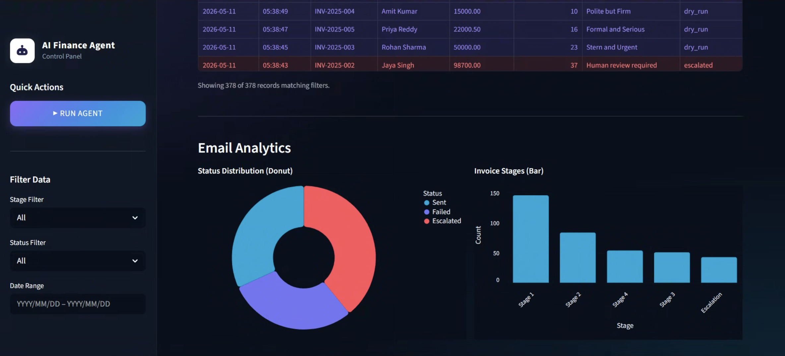

# Finance Credit Follow-Up Email Agent

An AI-powered agent that reads overdue invoice records, determines the correct escalation stage based on days overdue, generates personalised follow-up emails using Llama 3 (via Groq API), sends or mock-sends them, and logs every action to a `dry_run_log.json` file.

Built with **Python**, **Groq API (Llama 3)**, **Celery + Redis**, **APScheduler**, and **Streamlit**.

---

## Dashboard Previews


*The main dashboard showing high-level processing metrics and the full activity timeline.*


*Visual analytics breaking down the status distribution and escalation stages.*


*Detailed filtering capabilities by stage, status, and custom date ranges.*

---

## Architecture

```
┌──────────────┐     ┌───────────────┐     ┌──────────────┐
│  invoices.csv│────▶│   Ingestor    │────▶│  Tone Engine │
│  (data/)     │     │  (pandas +    │     │  (stage 1-4  │
└──────────────┘     │   pydantic)   │     │  / ESCALATE) │
                     └───────────────┘     └──────┬───────┘
                                                  │
                          ┌───────────────────────▼──────────────┐
                          │         Email Generator              │
                          │        (Groq / Llama 3)              │
                          │   system prompt → JSON {subj, body}  │
                          └───────────────────────┬──────────────┘
                                                  │
                     ┌────────────────────────────▼────────────┐
                     │              Sender                     │
                     │   DRY_RUN=true  → console + JSON log    │
                     │   DRY_RUN=false → SMTP real send        │
                     └────────────────────────────┬────────────┘
                                                  │
                     ┌────────────────────────────▼────────────┐
                     │             JSON Log File               │
                     │ dry_run_log.json — every attempt logged │
                     │ useful for local review & preview       │
                     └────────────────────────────┬────────────┘
                                                  │
                     ┌────────────────────────────▼────────────┐
                     │      Streamlit Dashboard (app.py)       │
                     │   metrics · audit table · run controls  │
                     └─────────────────────────────────────────┘
```

---

## Setup Instructions

### 1. Clone the repository

```bash
git clone <repo-url>
cd finance-email-agent
```

### 2. Create a virtual environment

```bash
python -m venv venv
# Windows
venv\Scripts\activate
# macOS/Linux
source venv/bin/activate
```

### 3. Install dependencies

```bash
pip install -r requirements.txt
```

### 4. Configure environment variables

```bash
cp .env.example .env
# Edit .env and set your GROQ_API_KEY
```

### 5. Start Redis (required for Celery only)

```bash
# Docker
docker run -d -p 6379:6379 redis:latest

# Or install Redis natively
```

### 6. Start the Celery worker (optional — for async processing)

```bash
celery -A celery_app worker --loglevel=info
```

### 7. Run the agent

```bash
# Dry run — no real emails sent
python main.py --dry-run

# Real send
python main.py --send

# View audit summary
python main.py --summary

# Process one specific invoice
python main.py --invoice INV-2025-003
```

### 8. Launch the dashboard

```bash
streamlit run app.py
```

---

## Dry-Run vs Real Send

| Mode | Command | What happens |
|------|---------|-------------|
| **Dry Run** (default) | `python main.py --dry-run` | Emails printed to console, logged to `dry_run_log.json`, no SMTP |
| **Real Send** | `python main.py --send` | Emails sent via SMTP using credentials in `.env` |

The `DRY_RUN` environment variable defaults to `true` — you must explicitly set it to `false` (or use `--send`) to dispatch real emails.

---

## Tech Stack & Rationale

| Component | Technology | Rationale |
|-----------|-----------|-----------|
| **LLM** | Groq (Llama 3) | High-quality text generation with structured JSON output |
| **Data Validation** | Pydantic v2 | Type-safe models for both input (invoices) and output (emails) |
| **Task Queue** | Celery + Redis | Async processing with retry logic and rate limiting |
| **Scheduler** | APScheduler | Lightweight cron-like scheduling without OS-level cron |
| **JSON Log** | Local File | Simple file-based JSON logging for quick review |
| **Dashboard** | Streamlit | Rapid prototyping of data-centric UIs |
| **Config** | python-dotenv | Secure env-var management, no hardcoded secrets |

---

## Security Mitigations

| Risk | Mitigation |
|------|-----------|
| **Prompt Injection** | All user-supplied fields (`client_name`, `invoice_no`) are sanitised — `<`, `>`, `"`, and newlines are stripped before prompt insertion. The system prompt instructs the LLM to return only JSON. |
| **Data Privacy / PII** | Contact emails and raw messages are logged locally in `dry_run_log.json` for review. This file should be treated as sensitive and is gitignored. |
| **API Key Exposure** | All secrets loaded from `.env` via `python-dotenv`. `.env` is gitignored. `.env.example` contains only placeholder values. |
| **Hallucination Risk** | LLM output is validated against a strict Pydantic schema (`EmailOutput`). All invoice fields are provided in the prompt — the model is instructed never to fabricate data. |
| **Unauthorised Access** | SMTP credentials are environment-scoped. `DRY_RUN=true` is the default — real emails require explicit opt-in. Celery tasks are rate-limited to 10/min. |
| **Email Spoofing** | SMTP auth with TLS is enforced. `SENDER_EMAIL` is configured separately. In production, deploy with SPF/DKIM/DMARC on the sending domain. |

---

## Sample Output

### Stage 1 — Warm and Friendly (4 days overdue)

```json
{
  "subject": "Friendly Reminder: Invoice INV-2025-001 — Payment Due",
  "body": "Dear Rajesh,\n\nI hope this message finds you well! This is a gentle reminder that Invoice INV-2025-001 for ₹45,000.00 was due on 2026-05-06 and is currently 4 days overdue.\n\nWe understand that things can slip through the cracks, so we wanted to send a friendly nudge. You can make your payment quickly and securely using the link below:\n\n🔗 https://pay.example.com/inv/INV-2025-001\n\nIf you've already made this payment, please disregard this reminder. If you have any questions, feel free to reach out — we're happy to help!\n\nWarm regards,\nFinance Team"
}
```

### Stage 4 — Stern and Urgent (25 days overdue)

```json
{
  "subject": "URGENT: Final Notice — Invoice INV-2025-006 Overdue by 25 Days",
  "body": "Dear Kavitha Reddy,\n\nThis is your FINAL REMINDER regarding the outstanding payment for Invoice INV-2025-006.\n\nInvoice Details:\n- Invoice Number: INV-2025-006\n- Amount Due: ₹56,000.00\n- Original Due Date: 2026-04-15\n- Days Overdue: 25\n\nDespite multiple prior communications, this payment remains unresolved. We must inform you that failure to remit the full amount within the next 24 hours will result in immediate escalation to our legal and recovery team.\n\nThis may affect your credit terms and future business relationship with us.\n\nMake your payment immediately:\n🔗 https://pay.example.com/inv/INV-2025-006\n\nThis is a final notice. We strongly urge you to act without delay.\n\nRegards,\nFinance & Recovery Team"
}
```

---

## Agent Flow

1. **Ingest** — `ingestor.py` reads `data/invoices.csv`, validates columns, parses dates, computes `days_overdue`, and filters for overdue records only. Returns a list of Pydantic `InvoiceRecord` objects.

2. **Classify** — `tone_engine.py` maps `days_overdue` to one of five outcomes:
   - 1–7 days → `stage_1` (Warm and Friendly)
   - 8–14 days → `stage_2` (Polite but Firm)
   - 15–21 days → `stage_3` (Formal and Serious)
   - 22–30 days → `stage_4` (Stern and Urgent)
   - 31+ days → `ESCALATE` (flagged for legal review, no email sent)

3. **Generate** — `email_gen.py` calls the Groq API (Llama 3) with a structured prompt containing the invoice details and tone instructions. The response is parsed and validated as an `EmailOutput` (subject + body).

4. **Send** — `sender.py` dispatches the email. In dry-run mode (default), the email is printed to console and logged to `dry_run_log.json`. In real mode, it is sent via SMTP with TLS.

5. **Log** — The agent logs all email previews directly to `dry_run_log.json` for manual inspection and record-keeping.

6. **Dashboard** — `app.py` provides a Streamlit UI showing metrics, the full audit trail, and manual trigger controls.

---

## License

MIT
